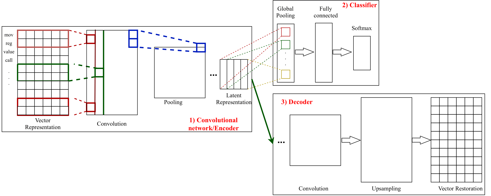

<h2 align="center">
Faulty Code Detection 
</h2>

The official implementation of the paper [Semi-supervised Multi-task Learning Using Convolutional AutoEncoder for Faulty Code Detection with Limited Data]().

<!-- Table of content-->

## Table of contents
* [Introduction](#introduction)
* [Installation](#installation)
* [Usage](#usage)
* [Contact](#contact)


## Introduction
We proposes a semi-supervised multitask learning framework to overcome the limited data problem for **F**aulty **C**ode **D**etection. 
The framework has two parts including 1) a convolutional autoencoder performing the auxiliary task that is learning the latent representations of programs 
and 2) a sequence-based convolution for the main task of faulty code prediction. Our proposed model is shown below:

<p align="center">

</p>

You can follow this [paper]() for more details.

## Installation

* Python 3.5+ is required.

**1. Clone project**

```sh
git clone https://github.com/kcsmta/FCD_ae_cnn_multitask.git
```

**2. Run following command:**

```sh
# Create virtual enviroment
python venv ae-cnn-multitask-env
# Active virtual enviroment
source ae-cnn-multitask-env/bin/activate
# Install requirement packages
(venv) pip install -r requirements.txt
```

## Usage
You should change the variable *data_part* in the file *FCD_models/params.py* to 1.0, 0.75, 0.5, and 0.25 corresponding to using the number of labeled data in training phase as 100%, 75%, 50%, and 25%.

**1. CNN:** Convolutional neural network (as the classification branch without the autoencoder)
```sh
python run_train_cnn.py
```
**2. CNN_trans:** Convolutional neural network with transfer learning
```sh
python run_train_cnn_transfer.py
```
**2'. AE:** train the autoencoder as parameter initialization for AE_CNN and AE_CNN_Mul
```sh
python run_train_ae.py
```
**3. AE_CNN:** We first train the autoencoder and then remain the weights
for the part 1 of convolutions to train CNN independently. This can
be considered as a type of self-transfer learning because we initialize the
weights using the same data but without target label information.
```sh
python run_finetune_cnn.py
```
**4. CNN_Mul:** the autoencoder and CNN are trained simultaneously from scratch.
```sh
python run_train_cnn_multi_task.py
```

**5. AE_CNN_Mul:** The autoencoder is pretrained and then we continue training the whole model.
```sh
python run_finetune_cnn_multi_task.py
```

* To visualize latent embedding vector:
```sh
cd visulize_embedding/
python run_visualize.py
```

* To plot ROC curve:
```sh
cd draw_roc/
python plot_roc_multiclasses.py
```

## Contact
Authors: \
[Anh Phan Viet](): anhpv@lqdtu.edu.vn \
[Khanh Duy Tung Nguyen]() : tungkhanh@lqdtu.edu.vn